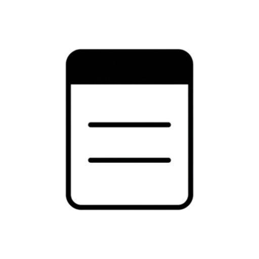

<p align="center">
  
</p>

<h1 align="center">To-Do</h1>

<p align="center">
  <em>A minimal to-do app built with Jetpack Compose & Material 3</em>
</p>

<p align="center">
  <a href="#features">Features</a> •
  <a href="#download">Download</a> •
  <a href="#tech-stack">Tech Stack</a> •
  <a href="#building">Building</a>
</p>

---

## Features

- Create, edit & delete tasks
- Drag-to-reorder tabs and items
- Tab-based organization
- Search through tasks
- Material 3 Design with dark mode
- Home screen widget (Glance App Widget)
- Persistent storage via Room database

## Download

| Variant | APK |
|---------|-----|
| Debug   | [notes.apk](app/build/outputs/apk/debug/notes.apk) |

> Requires **Android 8.0+ (API 26)**.

## Tech Stack

| Layer | Tech |
|-------|------|
| UI | Jetpack Compose + Material 3 |
| Architecture | MVVM (ViewModel + Repository) |
| Database | Room (SQLite) with KSP |
| Widget | Glance AppWidget |
| Build | Gradle KTS + Kotlin |

## Building

```bash
git clone https://github.com/nerrawlmao/Notes.git
cd Notes
./gradlew assembleDebug
```

APK output: `app/build/outputs/apk/debug/notes.apk`

---

<p align="center">
  Made with Kotlin
</p>
